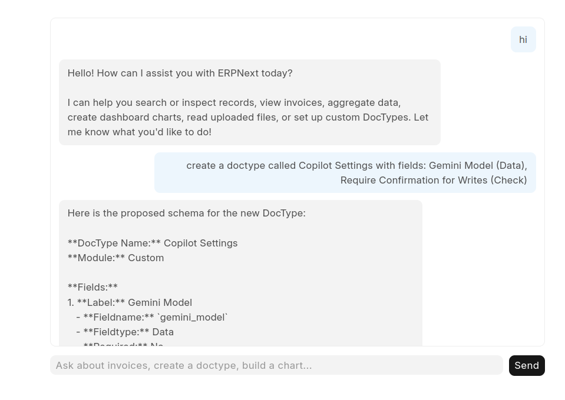
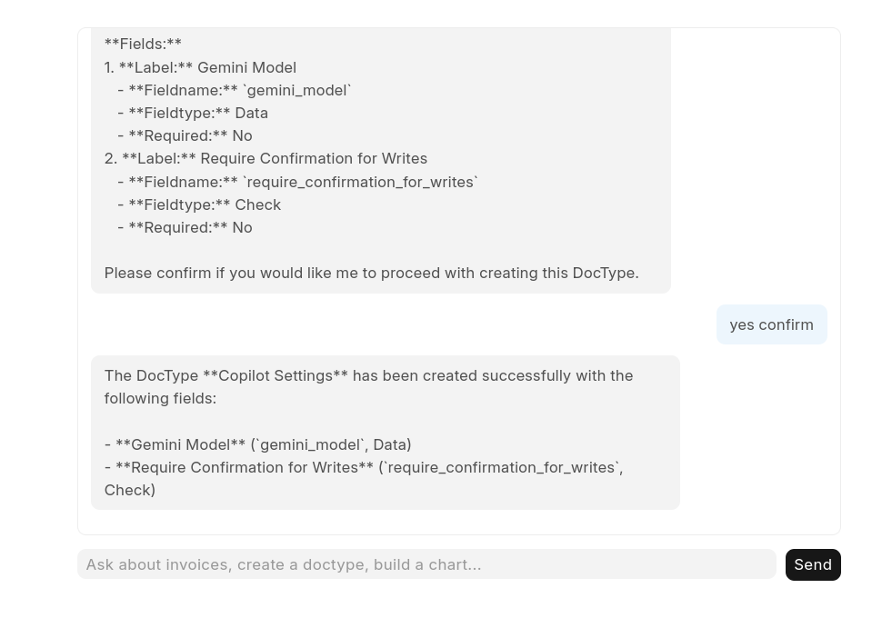
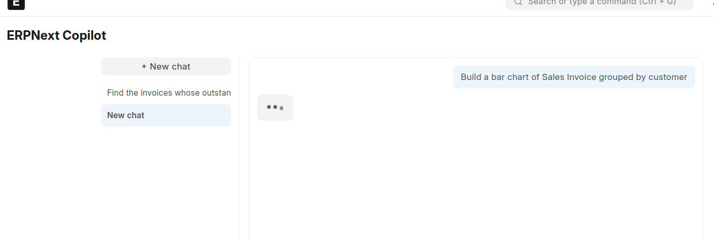
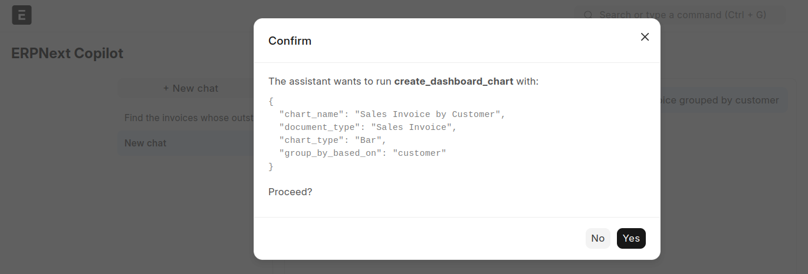
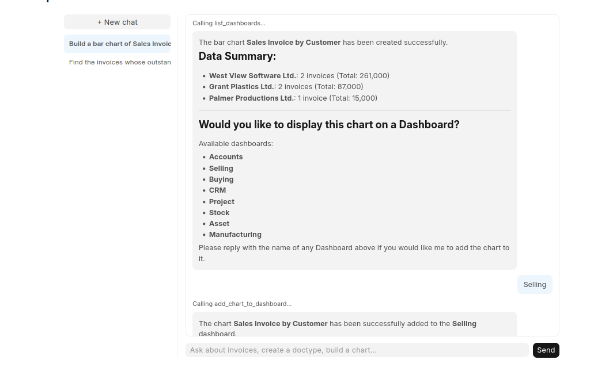

# erpnext_copilot

> Ask your ERPNext site to do things, in plain English. A self-built Gemini-powered agent for ERPNext, running as a real installed Frappe app.

## What you get

Type things you'd normally click through ERPNext's UI for:

"Show me sales invoices grouped by customer."
"Create a doctype called Vehicle Maintenance Log with fields Vehicle, Date, Cost."
"Build a bar chart of sales invoices by customer."
"Preview the file I just uploaded before I import it."

Gemini decides which tool to call and with what arguments; the tool runs as your actual logged-in ERPNext user, so permissions are enforced the same way they would be if you clicked through the UI yourself — no shared API key, no bypassing ERPNext's own access rules.

Anything that changes data (creating a DocType, creating a chart) stops and asks for confirmation first — in the browser as a real dialog, or in the console as a y/n prompt — showing exactly what it's about to do before it does it. Every write action is also logged to a permanent, tamper-resistant audit record (see Tool-call audit log below), independent of the conversation it happened in.

The web chat keeps a full conversation history, like ChatGPT or Claude:

A left sidebar lists your past conversations, auto-titled from your first message, most recent first. Switch between them or start a new one without losing anything.
Replies stream in live, with a typing indicator and per-tool-call status ("Calling aggregate_documents...") so a multi-step request doesn't look frozen while it works.
Agent replies render as markdown — tables, bold text, and lists show up properly instead of raw **/| characters.

## Screenshots













## Quick start

```bash
# from your bench directory
bench get-app <this-repo-url>
bench --site your-site install-app erpnext_copilot
bench --site your-site migrate   # creates the conversation/audit-log tables
# get a free key from https://aistudio.google.com/apikey
bench --site your-site set-config gemini_api_key "your-key"
```

**Console:**
```bash
bench --site your-site console
```
```python
from erpnext_copilot.custom_code.gemini_agent import run
run()
```

**Web chat UI:** visit `/app/copilot_chat` on your site.

## Tools at a glance

| Category | Tools |
|---|---|
| Search & fetch | `search_documents`, `search_doctype`, `fetch`, `search` |
| Aggregation | `aggregate_documents`, `list_invoices` |
| Schema | `get_doctype_fields` |
| Files | `read_uploaded_file`, `clean_uploaded_file`, `import_data_to_doctype`|
| Create (confirmed before running) | `create_doctype`, `create_dashboard_chart` |
|Dashboards | `list_dashboards`

Search and aggregation tools work against any DocType — they take a doctype parameter rather than being hardcoded per document type, and validate it against Frappe's real metadata before building a query.

## Architecture

```
User message (console or web chat)
        │
        ▼
Gemini — decides which tool to call, in a loop, so a single
message like "show X, then create Y" can chain multiple calls
        │
        ├─ read tool ──► dispatched immediately
        │
        └─ write tool ─► logged to Copilot Tool Call (Awaiting Confirmation)
                          │
                          ▼
                    user confirms/cancels in the browser
                          │
                          ▼
        Tool dispatch → api.py (@frappe.whitelist() methods)
        │
        ▼
frappe.get_all() / frappe.get_doc() / frappe.db.sql()
        │   runs as the real logged-in user — permissions
        │   enforced natively by Frappe, not by this app
        ▼
ERPNext database
```

Two front ends share the same tool layer: gemini_agent.py (console REPL) and agent_api.py (whitelisted HTTP endpoints for the web chat page). The console REPL keeps history in memory for the life of the process; the web chat persists it, since HTTP has no equivalent persistent process.

Persistence — two custom DocTypes, both scoped by Frappe's own if_owner permission so users only ever see their own data:

Copilot Conversation — one record per chat thread (title, serialized message history, last-message timestamp). What the sidebar lists and what ask_agent/confirm_pending_action load and save on every turn.
Copilot Tool Call — one record per write-tool invocation, logged the moment the model proposes it (Awaiting Confirmation) and resolved once the user decides (Success / Error / Cancelled). Exists independently of conversation history — deleting a conversation from the sidebar doesn't erase the record of what it did. The controller blocks editing the logged tool name or arguments after creation, so the record can't be rewritten after the fact.

Streaming — replies and per-tool-call status are pushed to the browser live over Frappe's built-in realtime (Socket.IO) channel via frappe.publish_realtime, rather than the browser waiting for one blocking HTTP response. The synchronous whitelisted call is still what actually persists state; streaming is purely for perceived responsiveness.

<!-- ## Relationship to prior art

ERPNext + LLM agents isn't a new idea. Before building this, I looked at
what already exists — most notably
[**Frappe_Assistant_Core**](https://github.com/buildswithpaul/Frappe_Assistant_Core),
a production-grade project with OAuth2/PKCE per-user auth, 24 tools, a
plugin system, and commercial support. This project doesn't try to
compete with that — it's smaller, self-built, and exists so I'd have
hands-on experience with the actual pattern (tool-calling against a real
ERP's permission model) rather than just being able to
describe it.

Where the design overlaps with FAC — generic, DocType-agnostic tools
(`search_documents`, `aggregate_documents`) instead of one function per
document type — I arrived at it independently and only confirmed the
overlap afterward by reading their code. Where it differs: FAC
authenticates external clients (Claude Desktop, ChatGPT) via OAuth so
*they* can act as a real user over the network; this project runs
in-process inside Frappe, so permission enforcement comes from already
being the logged-in session user, which is a different, considerably
smaller problem to solve.

<!-- For the full list of real bugs hit and fixed while building this — SDK
quirks, ERPNext validation surprises, a Gemini 3.x API requirement that
only showed up in the web interface — see
[`DEBUGGING.md`](./DEBUGGING.md). Kept deliberately, not smoothed over. --> -->

## Known limitations

-No update/submit/cancel/delete tools yet — every write tool only creates something new. Marking an invoice paid, submitting a Purchase Order, or reassigning a ticket all still require the regular ERPNext UI. This is the single biggest functional gap right now.

- clean_uploaded_file makes its own separate blocking call to Gemini, on top of whatever the main tool loop is doing — it hasn't been moved to a background job yet, so a large cleaning request can hold the request thread for a while.

- The tool-call audit log (Copilot Tool Call) is written on every write action, but nothing in the UI displays it yet — get_tool_calls() exists and works, it's just not wired into a panel.

- The console REPL (gemini_agent.py's run()) hasn't received the recent upgrades to the web chat — no streaming, no persisted multi-conversation history, no audit logging. The two front ends are no longer at parity.

- import_data_to_doctype reports failures as a flat list with no way to retry just the failed rows.

- No automated test suite yet; verification has been manual, tool-by-tool.

- Only tested as Administrator so far — multi-user/role-based permission behavior hasn't been verified end-to-end.

- For a user who already knows ERPNext's Report Builder and filters, typing a sentence to reproduce a filtered list is often slower than just applying the filter — this tool's real value is in write and multi-step operations, not simple reads.


## License

MIT